#######################################################################

# Binome : BEZMATERNYKH Igor / AUDIC Clément

#

## Jeu de données : pré-traitement

Donnez la liste des features et ce qu'elles représentent (préciser les éventuels changements effectués en pré-traitement ou si pas de changement)

- Liste des features :

* AGEP : L'age de la personne
* COW : Classe d'emploi (Civilian employed, Unemployed, Not in labor force, Armed forces)
* SCHL : Niveau d'éducation
* MAR : Statut marital
* OCCP : Emploi occupé en code que nous avons regrouppé en catégories
* POBP : Place of birth que nous avons regrouppé par régions géographiques (Afrique du Nord, Europe de l'Est)
* RELP : Relation par rapport à la personne possèdant le logement
* WKHP : Nombre d'heures travaillées par semaine
* SEX : Sexe
* RAC1P : Ethnicité

## Expérimentation 1 : Comparaison de modèles par défaut

- Jeux de données utilisé :

  - Taille ensemble d'entrainement (nb lignes et nb colonnes) : 124736 lignes et 10 colonnes
  - Taille ensemble de test (nb lignes et nb colonnes) : 41579 lignes et 10 colonnes

- Résultats (hyper-paramètres par défaut)

| Evaluation en train                 | Random Forest                                                   | Adaboost                                                    | XGBoost                                                |
| ----------------------------------- | --------------------------------------------------------------- | ----------------------------------------------------------- | ------------------------------------------------------ |
| accuracy                            | 0.9876699589533093                                              | 0.7991918932786044                                          | 0.8361018471010775                                     |
| Temps calcul (temps d'entrainement) | 23.58                                                           | 6.59                                                        | 1.77                                                   |
| Matrice confusion                   | 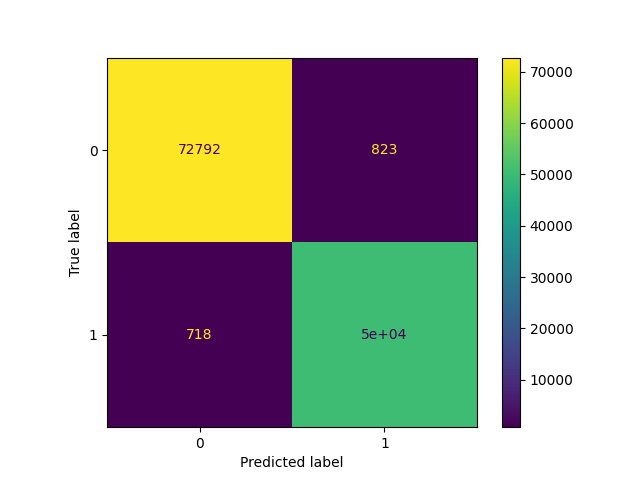 | 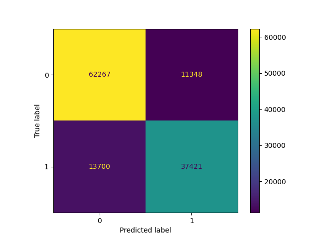 |  |

 

| Evaluation en test               | Random Forest                                             | Adaboost                                              | XGBoost                                          |
| -------------------------------- | --------------------------------------------------------- | ----------------------------------------------------- | ------------------------------------------------ |
| accuracy                         | 0.7996584814449602                                        | 0.7965800043291085                                    | 0.8172394718487698                               |
| Temps calcul (Temps d'inférence) | 1.27                                                      | 0.54                                                  | 0.05                                             |
| Matrice confusion                |  |  | 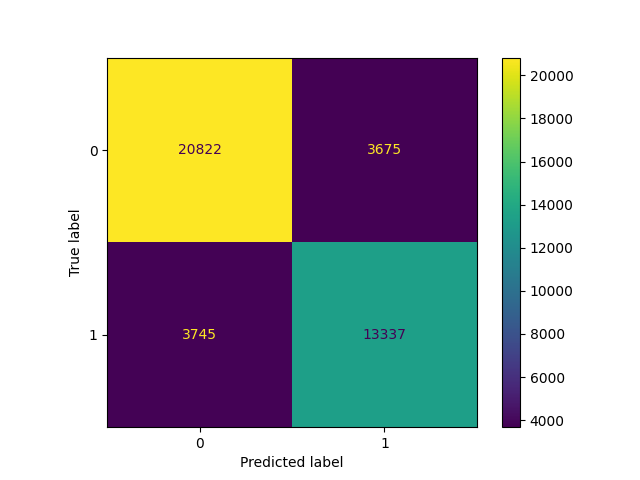 |

- Commentaires et Analyse :
  On remarque que le RandomForest a tendence à énormément overfit avec un score d'entrainement proche de 1 mais un score de test bien plus faible. L'Adaboost et le XGBoost ont des scores d'entrainement et de test plus proches, mais le XGBoost a de meilleurs performances globales. On remarque aussi que XGBoost est plusieurs fois plus rapide que les autres. Les temps d'inférence sont pluls proches mais on remarque que le XGBoost est plus optimisé puisqu'il est 10 fois plus rapide que les autres.

## Expérimentation 2 : Comparaison Modèles ML par défaut

- Jeux de données utilisé :
  - Taille ensemble d'entrainement : 124736 lignes et 10 colonnes
  - Taille ensemble de test : 41579 lignes et 10 colonnes

### Random Forest (RF)

- Processus d'entrainement :
  - Recherche des hyperparamètres : Utilisation d'Optuna, une bibliothéque faisant de la recherche de paramètres par optimisation bayésienne plutôt que par recherche exhaustive.
  - Listes des hyperparamètres testés et valeurs :
    > 'learning_rate': ('choice', [0.01, 0.05, 0.1]),
    > 'max_depth': ('choice', [1, 3, 6, 10, 15, 20]),
    > 'n_estimators': ("choice", [50, 100, 200, 300, 400]),
  - Nombre de plis pour la validation croisée : 3
  - Nombre total d'entrainement : $20 \times 3 = 60$
- Résultats :
  - Meilleurs hyperparamètres :
    > {'max_depth': 15, 'n_estimators': 300}
  - Performances en entraintement :
    - Accuracy : 0.8409440738840431
    - Temps de calcul : 36.44 seconds
    - Matrice de Confusion : 
  - Performance en test :
    - Accuracy : 0.8119964405108347
    - Temps de calcul : 1.62 seconds
    - Matrice de Confusion : 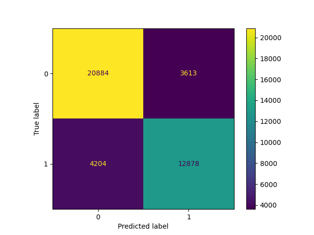
  - Commentaires / analyses (par rapport résultat expe 1)
    L'optimisation des hyperparamètres a permis d'améliorer la performance de RandomForest sur le dataset de test de 1.2% en réduisant l'overfitting. La différence entre les scores d'entrainement et de test est en effet nettement réduite, le score d'entrainement passant à 84% au lieu de 99%. Le temps d'entrainement s'est en revanche aggrandi à cause d'un plus grand nombre d'estimateurs.

### ADABOOST

AdaBoostClassifier || Test score: 0.8096635320714783 | Train score: 0.8127084402257568 | Training time: 34.25 seconds || Test time: 2.96 seconds

- Processus d'entrainement :
  - Recherche des hyperparamètres
  - Listes des hyperparamètres testés et valeurs :
    > 'learning_rate': {'type':'float', 'low':0.01, 'high':2},
    > 'n_estimators': {'type':'int', 'low':50, 'high':450, 'step':10},
  - Nombre de plis pour la validation croisée : 3
  - Nombre total d'entrainement : 60
- Résultats :
  - Meilleurs hyperparamètres : {'learning_rate': 1.7592424690135926, 'n_estimators': 210}
  - Performances en entraintement :
    - Accuracy : 0.8127084402257568
    - Temps de calcul : 34.25 seconds
    - Matrice de Confusion : 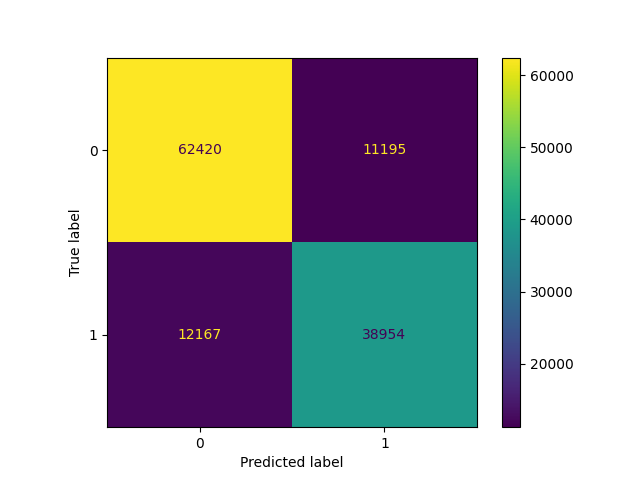
  - Performance en test :
    - Accuracy : 0.8096635320714783
    - Temps de calcul : 2.96 seconds
    - Matrice de Confusion : 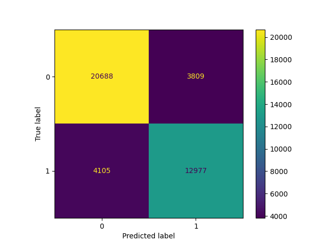
  - Commentaires / analyses (par rapport résultat expe 1)
    L'optimisation des hyperparamètres n'a pas été très efficace. Le score de test n'a augmenté que de 0.2%, avec un score d'entrainement qui a augmenté de 0.4%, ce qui veut dire qu'il ya peut être eu un léger overfitting. Le temps d'entrainement a en revanche beaucoup augmenté, passant de 6.59 secondes à presque 1 minute, ce qui est surement dû à l'augmentation du nombre d'estimateurs.

### XGBOOST

- Processus d'entrainement :
  - Recherche des hyperparamètres
  - Listes des hyperparamètres testés et valeurs :
    > 'learning_rate': ('choice', [0.05, 0.1, 0.3]),
    > 'max_depth': ('choice', [3, 6, 10, 15, 20]),
    > 'n_estimators': ("choice", [50, 100, 200, 400])
  - Nombre de plis pour la validation croisée : 3
  - Nombre total d'entrainement : 60
- Résultats :
  - Meilleurs hyperparamètres :
    > {'learning_rate': 0.05, 'max_depth': 6, 'n_estimators': 400}
  - Performances en entraintement :
    - Accuracy : 0.8320933812211391
    - Temps de calcul (temps d'entrainement) : 2.71 seconds
    - Matrice de Confusion : 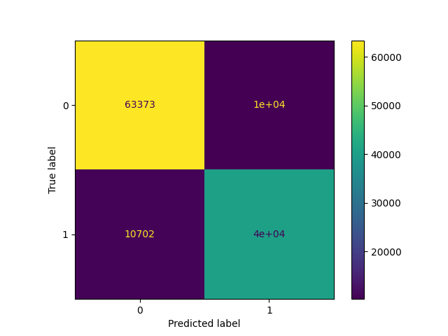
  - Performance en test :
    - Accuracy : 0.8193318742634503
    - Temps de calcul : 0.08 seconds
    - Matrice de Confusion : 
  - Commentaires / analyses (par rapport résultat expe 1)
    L'optimisation des hyperparamètres n'a pas été très efficace sur XGBoost, ce qui est normal, car c'est un modèle réputé pour être très performant et ne nécessitant pas beaucoup d'optimisation. On peut quand-même remarquer que l'on a pu éviter un peu d'overfitting car le score d'entrainement a baissé de 3% tandis que le score de test a augmenté de 0.2%. Le temps d'entrainement a par contre augmenté de manière peu significative.

## Expérimentation 3 : Comparaison des "meilleurs modèles

- Jeux de données utilisé :

  - Taille ensemble d'entrainement : 124736 lignes et 10 colonnes
  - Taille ensemble de test : 41579 lignes et 10 colonnes

- Résultats des meilleurs modèles obtenus dans Expe 2

| Evaluation en train | Random Forest                                                             | Adaboost                                                              | XGBoost                                                          |
| ------------------- | ------------------------------------------------------------------------- | --------------------------------------------------------------------- | ---------------------------------------------------------------- |
| accuracy            | 0.8409440738840431                                                        | 0.8127084402257568                                                    | 0.8320933812211391                                               |
| Temps calcul        | 36.44                                                                     | 34.25                                                                 | 2.71                                                             |
| Matrice confusion   |  |  |  |

| Evaluation en test | Random Forest                                                       | Adaboost                                                        | XGBoost                                                    |
| ------------------ | ------------------------------------------------------------------- | --------------------------------------------------------------- | ---------------------------------------------------------- |
| accuracy           | 0.8119964405108347                                                  | 0.8096635320714783                                              | 0.8193318742634503                                         |
| Temps calcul       | 1.62                                                                | 2.96                                                            | 0.08                                                       |
| Matrice confusion  |  |  |  |

- Commentaires et Analyse :

L'optimisation d'hyperparamètres a permis de réduire la différence de score entre les différents modèles. En fin de compte, XGBoost reste meilleur, mais la performance des deux autres s'en approchent. Générallement les temps de calcul ont augmenté, notamment du à l'augmentation du nombre d'estimateurs.

## Expérimentation 4 : inférence sur un autre jeu de données (optionnel)

Résultats / Commentaires / Analyses :
 

| Class        | Precision | Recall | F1-score | Support |
| ------------ | --------- | ------ | -------- | ------- |
| 0            | 0.88      | 0.73   | 0.80     | 18334   |
| 1            | 0.69      | 0.85   | 0.76     | 12972   |
| Accuracy     |           |        | 0.78     | 31306   |
| Macro Avg    | 0.78      | 0.79   | 0.78     | 31306   |
| Weighted Avg | 0.80      | 0.78   | 0.78     | 31306   |

 

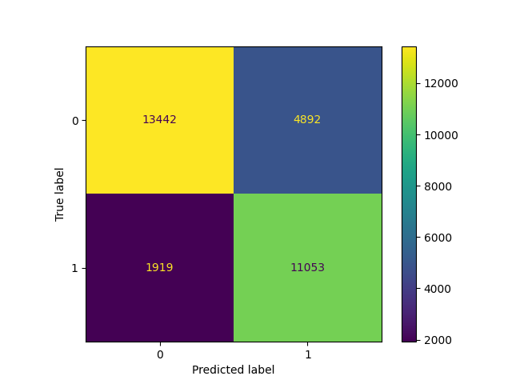

On peut voir que bien que les résultats sont moins bons, mais il n'est tout de même pas abérrant sur ce dataset du colorado, avec une accuracy de 0.78, ce qui veut dire que l'on na pas trop overfit. Cependant, on peut quand même supposer qu'il y a eu de l'overfitting étant donné que cette accuracy a baissé de 4% par rapport au dataset initial, même si cela peut être dû ç des.

## Expérimentation 5 : impact de la taille du jeu de données

Résultats / Commentaires / Analyses :  
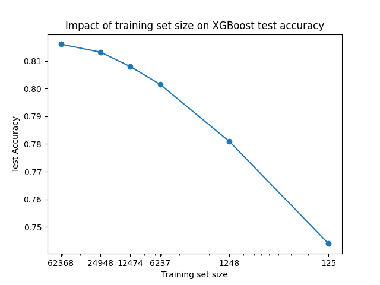

On peut voir que XGBoost est très peu impacté par la taille du dataset dans ce cas. Sa précision ne diminue vraiment que quand on passe en dessous de 20% de la taille initiale. Même avec 0.1% du dataset, la précion reste près de 75%. Cepandant cela est dû au fait quel'on a enlevé les samples par un échantillonnage aléatoire, ce qui le rend toujours relativement représentatif.
 
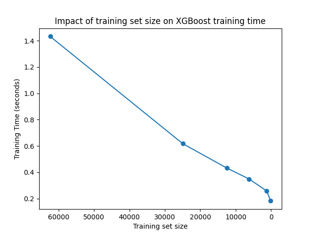

En ravanche on peut voir que le temps d'entrainement est assez significativement impacté par la taille du dataset, diminuant linéairement. Cependant étant donné que XGBoost est très rapide de base, diminuer ainsi la taille du dataset peut être intéressant que pour de très grands datasets ou des systèmes avec peu de ressources.

## Modèle choisi pour la suite :

- quel modèle :
  XGBoost avec
  > {'learning_rate': 0.05, 'max_depth': 6, 'n_estimators': 400}
- pourquoi ?
  C'est le modèle avec les meilleurs performances, que ce soit en termes de score ou de temps d'exécution. Ce qui permettra les tests les plus pertinents mais aussi les plus rapides à réaliser.

## Explicabilité : "permutation feature importance"

- Résultats obtenus :
  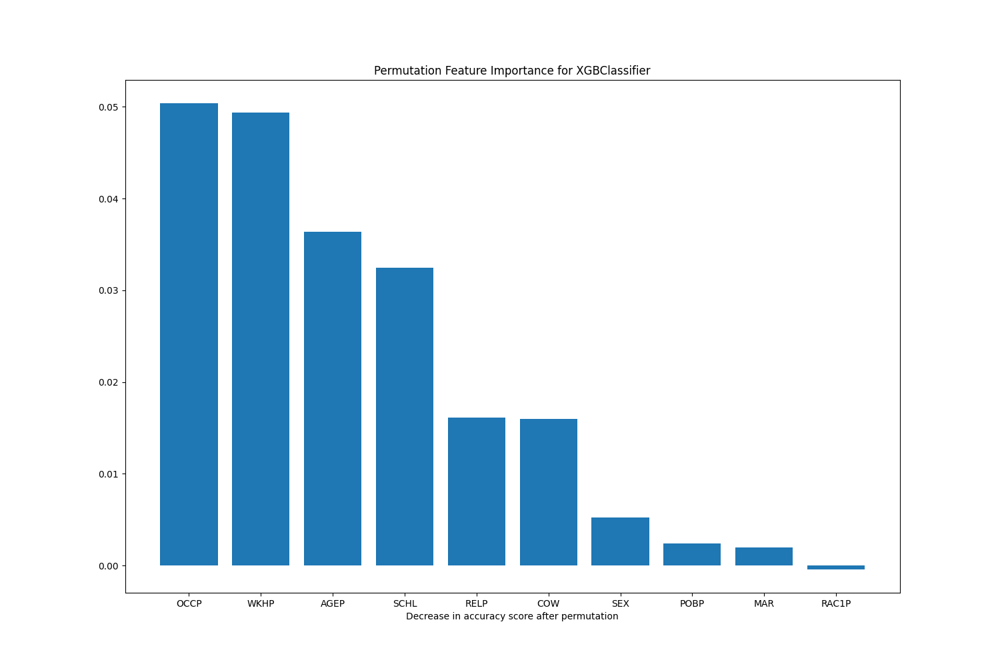
- Analyses :

## Explicabilité : avec LIME et SHAP

- Méthode LIME
  - Exemple(s) choisi(s)
    le premier exemple de la dataset de test
  - Résultats  
    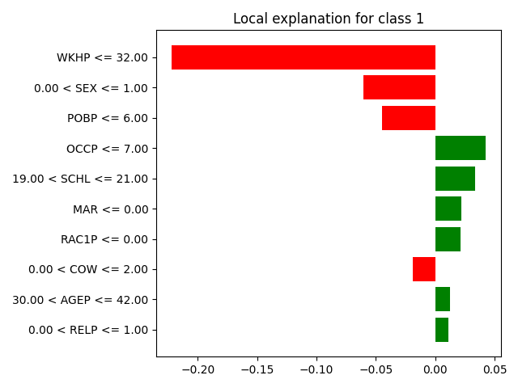
  - Commentaires / analyses
- Méthode SHAP
  - Exemple(s) choisi(s)
    le premier exemple de la dataset de test
  - Résultats  
    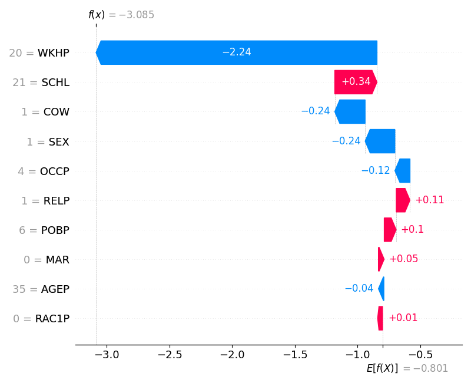
  - Commentaires / analyses
- Comparaison LIME et SHAP
- Analyse summary-plot de SHAP  
  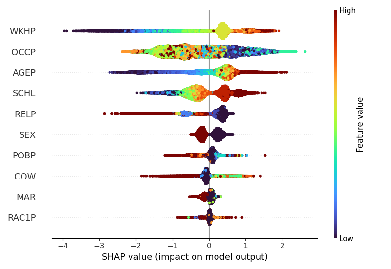

## Explicabilité : contrefactuelle

Résultats / Commentaires / Analyses :

Exemple choisi : le premier exemple de la dataset de test:  

- AGEP 35
- COW Employée
- SCHL Master
- MAR Mariée
- OCCP Community and Social Services
- POBP northern_america
- RELP Le mari possède la maison
- WKHP 20 h/semaine
- SEX Femme
- RAC1P White

On a vu par l'analyse SHAP et LIME que sur cet execmple, le principar facteur discriminant est le nombre d'heures travailléess par semaine. On l'augmente donc à 40, sans toucher aux autres features.  

Résultat: Classe prédite 2

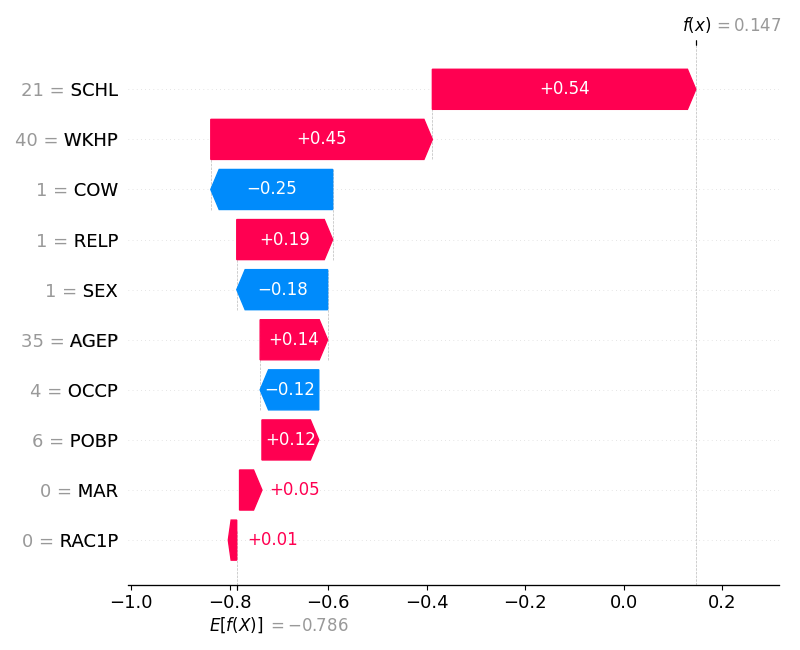

On voit direcment qu'avec le changement du nombre d'heures travaillées par semaine, le sample a été classé de manière tout à fait différente, avec l'influence des autres features changeant aussi. Cela confirme à quel point le modèle est sensilble à cette feature.
